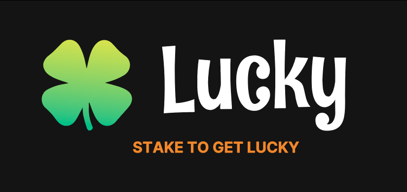

# Lucky

## Description

This repository is the UI for [Lucky contract](https://github.com/GuiGou12358/lucky-contracts)

this branch is deployed on https://lucky.substrate.fi/

## Usage

Please make sure you have an installed Extension (Polkadot.js compatible)

*Currently the dApp is available on Sibuya and Shiden*

On Shibuya, you need SBY to try it, you can get some by using the faucet available here: https://portal.astar.network/#/shibuya-testnet/assets

On Shiden you can use it with SDN and stake to win tokens with real value!

### You Can :

- Connect your Account
- Go to the Lucky Contract on dApp Staking to stake assets
- See surrent state of rewards if you stake
- claim your rewards
- Display the rewards history

## Development

To run the development server:npm run dev

``yarn dev``

Open [http://localhost:3000](http://localhost:3000) with your browser to see the result.

### Available on

- [X] Shibuya testnet
- [X] Shiden
- [ ] Astar Mainnet
